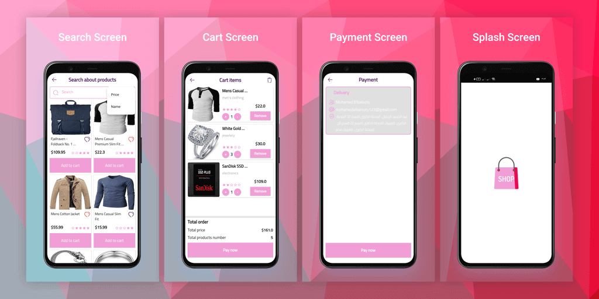

# Shop Store

Shop store is the e-commerce application that show products on some categories like Electronics and Clothes.
I applied all logic you can occurred on any commerce app such as cart items , filtering by price or product name , local favourite products and detect current location and address when user pay on that.

-----------------------------------------------------------------------------

## App Design :

-----------------------------------------------------------------------------

### Plugins and Concepts :

- This project is built using MVC architecture pattern with Getx for state management.
- Firebase to authenticate with email and password, email verification and forget password.
- Google sign in.
- Facebook sign in.
- Remote data from (http://fakestoreapi.com/) api source.
- GetStorage for caching data and save favourite products on local.
- Functional programming concept using dartz plugin for handling server errors and exceptions.
- Shimmer package to make custom loading animation.

-----------------------------------------------------------------------------

### App Features :

- Native Splash screen.
- Support Arabic and English languages using Getx.
- Search bar for searching about any product.
- Possibility to save favorite product.
- Dark mode and Light mode.

-----------------------------------------------------------------------------
# shop_store

A new Flutter project.

## Getting Started

This project is a starting point for a Flutter application.

A few resources to get you started if this is your first Flutter project:

- [Lab: Write your first Flutter app](https://flutter.dev/docs/get-started/codelab)
- [Cookbook: Useful Flutter samples](https://flutter.dev/docs/cookbook)

For help getting started with Flutter, view our
[online documentation](https://flutter.dev/docs), which offers tutorials,
samples, guidance on mobile development, and a full API reference.

